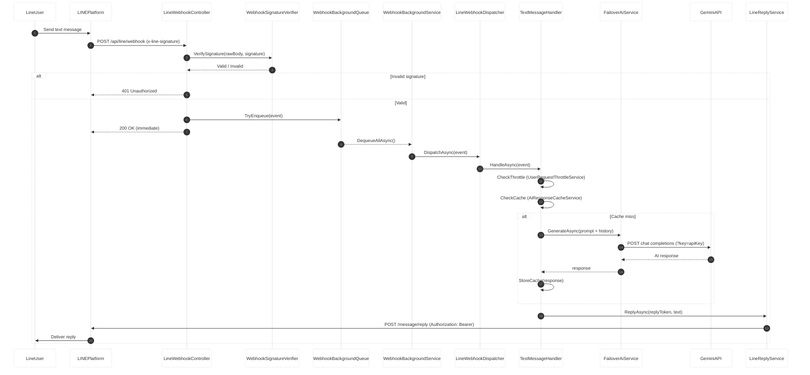
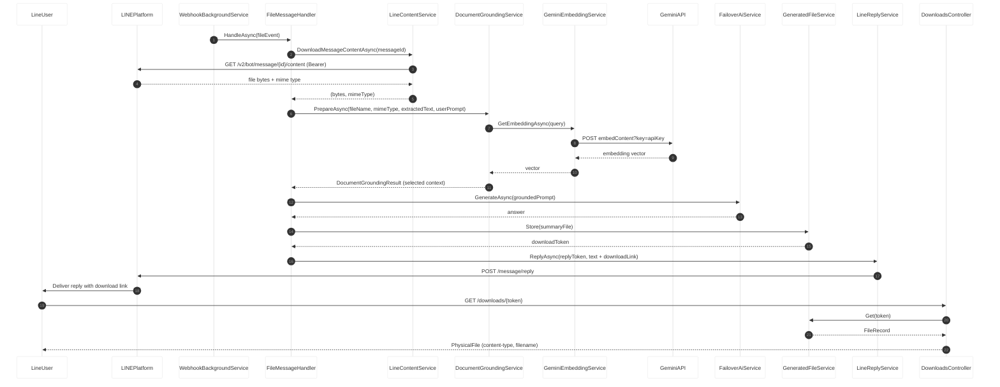
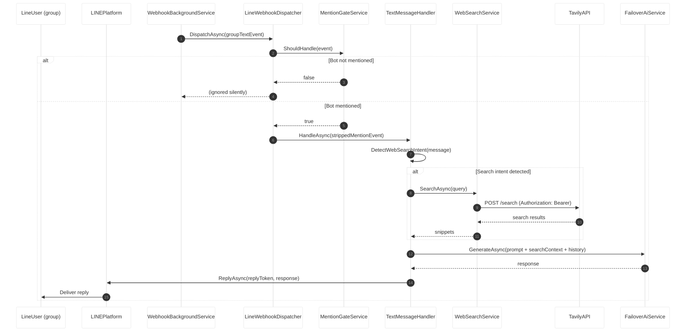

# Architecture Overview

**Project:** LINE Bot Webhook — `LineBotWebhook`
**Repository:** `https://github.com/arcobaleno64/LINE-BOT.git`
**Commit:** `811b2f5` (branch `main`)
**Analysis Date:** 2026-04-17
**Analyst:** threat-model-analyst skill (GitHub Copilot)

---

## 1. System Purpose

A LINE Messaging API webhook server built on ASP.NET Core .NET 10, deployed as a single Render web service. The system receives webhook events from LINE Platform (authenticated via HMAC-SHA256), processes text, image, and file messages with a multi-provider AI pipeline (Gemini → Claude → OpenAI failover), and replies via the LINE Messaging API. Additional capabilities include:

- **Document QA pipeline** — uploads are extracted, chunked, and semantically grounded before AI answering
- **Web search augmentation** — intent-detected queries are enriched with Tavily web search results
- **Conversation history** — per-user rolling session history injected as AI context
- **Group chat mention gate** — only responds when `@bot` mentioned in group/room chats

---

## 2. Component Inventory

| Component | Type | Boundary | Description |
|-----------|------|----------|-------------|
| `LineWebhookController` | Process | Application | HTTP entry point (`POST /api/line/webhook`); reads raw body, verifies signature, enqueues events |
| `DownloadsController` | Process | Application | Serves generated files (`GET /downloads/{token}`) — no auth, 128-bit GUID token |
| `WebhookSignatureVerifier` | Process | Application | HMAC-SHA256 + `CryptographicOperations.FixedTimeEquals`; rejects empty/invalid signatures |
| `WebhookBackgroundQueue` | Data Store | Application | Bounded in-memory channel (capacity 256); drops events when full |
| `WebhookBackgroundService` | Process | Application | `IHostedService` worker; dequeues and dispatches events with per-event exception isolation |
| `LineWebhookDispatcher` | Process | Application | Routes events by source type + message type; enforces group mention gate |
| `TextMessageHandler` | Process | Application | Text pipeline: throttle → AI cache → date/time → web search → AI → reply |
| `ImageMessageHandler` | Process | Application | Downloads image from LINE; sends bytes + prompt to AI for vision analysis |
| `FileMessageHandler` | Process | Application | Downloads file; extracts text; runs document grounding pipeline; AI QA; generates download |
| `FailoverAiService` | Process | Application | Multi-provider AI orchestrator (Gemini → Claude → OpenAI); manages 429 backoff, in-flight merge |
| `GeminiService` | Process | Application | Gemini REST client; dual-key routing; API key appended as `?key=` URL parameter |
| `LineReplyService` | Process | Application | LINE Messaging API reply client (`Authorization: Bearer`) |
| `LineContentService` | Process | Application | Downloads message content from LINE API; enforces 10 MB size limit |
| `WebSearchService` | Process | Application | Tavily search client (`Authorization: Bearer`); intent-gated |
| `GeminiEmbeddingService` | Process | Application | Gemini embedding API client; API key in URL `?key=`; used for semantic chunk selection |
| `ConversationHistoryService` | Data Store | Application | In-memory session store (max 1000 sessions, 15 rounds, 480 min TTL) |
| `AiResponseCacheService` | Data Store | Application | In-memory AI response cache (max 5000 entries, TTL-based pruning) |
| `UserRequestThrottleService` | Data Store | Application | Per-user cooldown tracker (max 2000 entries) |
| `GeneratedFileService` | Data Store | Application | Local disk store for generated download files; Guid token (24 h TTL) |
| `LineUser` | External Interactor | External | LINE app user; ultimate source of messages and consumer of replies/downloads |
| `LINEPlatform` | External Service | External | LINE Messaging API — delivers webhooks to our endpoint; receives reply calls |
| `GeminiAPI` | External Service | External | Google Gemini generative AI + embedding API |
| `ClaudeAPI` | External Service | External | Anthropic Claude AI API |
| `OpenAIAPI` | External Service | External | OpenAI API |
| `TavilyAPI` | External Service | External | Tavily web search API |

---

## 3. Deployment & Infrastructure

| Property | Value |
|----------|-------|
| Platform | Render cloud (single web service) |
| Runtime | ASP.NET Core .NET 10, Kestrel + Render TLS proxy |
| Process count | 1 (single process, all state in-process) |
| Persistence | None — all state is in-memory or local disk (ephemeral) |
| Env variables | LINE channel secret, LINE channel access token, Gemini API keys (×2), Claude API key, OpenAI API key, Tavily API key, `App:PublicBaseUrl` |
| Ingress | Render HTTPS → Kestrel on port 8080 |
| Spin-down | Free tier spins down after inactivity; cold-start resets all in-memory state |

---

## 4. Data Flow Summary

```
LineUser → [LINE app] → LINEPlatform ──POST /api/line/webhook──▶ LineWebhookController
                                                                           │ HMAC verify
                                                                    WebhookSignatureVerifier
                                                                           │ enqueue
                                                                  WebhookBackgroundQueue
                                                                           │ dequeue
                                                                  WebhookBackgroundService
                                                                           │ dispatch
                                                                  LineWebhookDispatcher
                                                     ┌─────────────────────┴─────────────────────┐
                                              TextMessageHandler    ImageMessageHandler    FileMessageHandler
                                                     │                      │                      │
                                              FailoverAiService    FailoverAiService    DocumentGroundingService
                                                     │                      │                      │
                                            GeminiAPI/Claude/OpenAI  GeminiAPI         GeminiEmbeddingService
                                                                                                   │
                                                                                         GeneratedFileService → disk
                                                     └─────────────────────┬─────────────────────┘
                                                                  LineReplyService
                                                                           │
                                                            LINEPlatform ──▶ LineUser

LineUser ──GET /downloads/{token}──▶ DownloadsController ──▶ GeneratedFileService ──▶ local disk
```

---

## 5. Sequence Diagrams

### Scenario 1: Incoming Text Message — Full Pipeline



### Scenario 2: File Upload — Document QA Pipeline



### Scenario 3: Group Chat — Mention Gate + Web Search



---

## 6. Trust Boundaries

| Boundary | Scope | Crossing Points |
|----------|-------|-----------------|
| `Application` | All code running within the Render web service process | Webhook HTTPS ingress; LINE API calls; AI API calls; Tavily API calls |
| `External` | LINE Platform, Gemini API, Claude API, OpenAI API, Tavily API, end-user browser | `POST /api/line/webhook`; `GET /downloads/{token}`; outbound HTTPS calls |

**Key boundary-crossing flows:**
- `LINEPlatform → LineWebhookController`: HMAC-SHA256 authenticated; raw body preserved before parsing
- `LineUser → DownloadsController`: Token-gated (128-bit Guid); no auth system
- `FailoverAiService → GeminiAPI/ClaudeAPI/OpenAIAPI`: API key authenticated; outbound HTTPS
- `WebSearchService → TavilyAPI`: Bearer token authenticated; outbound HTTPS

---

## 7. Security-Relevant Properties

| Property | Status |
|----------|--------|
| Signature verification before processing | ✅ HMAC-SHA256 + constant-time compare, before queue enqueue |
| Hardcoded credentials | ✅ None detected in tracked files |
| Group chat gating | ✅ `IsSelf == true` + @mention check |
| Memory bounds enforced | ✅ 1000 sessions, 5000 cache, 2000 throttle, 256 queue |
| File size limit | ✅ 10 MB, checked at Content-Length header + actual byte count |
| Download token randomness | ✅ `Guid.NewGuid().ToString("N")` — 128-bit random |
| Per-event exception isolation | ✅ Worker wraps each event in try/catch |
| Tavily API key in HTTP header | ✅ Patched (was in JSON body) |
| API keys for Gemini/Embedding | ⚠️ In URL query parameter `?key=` — may appear in access logs |
| PublicBaseUrl fallback | ⚠️ Falls back to request.Host if not configured |
| No IP-level rate limiting | ⚠️ No rate limiting before signature check |
| Webhook event idempotency | ⚠️ No deduplication on webhookEventId |
