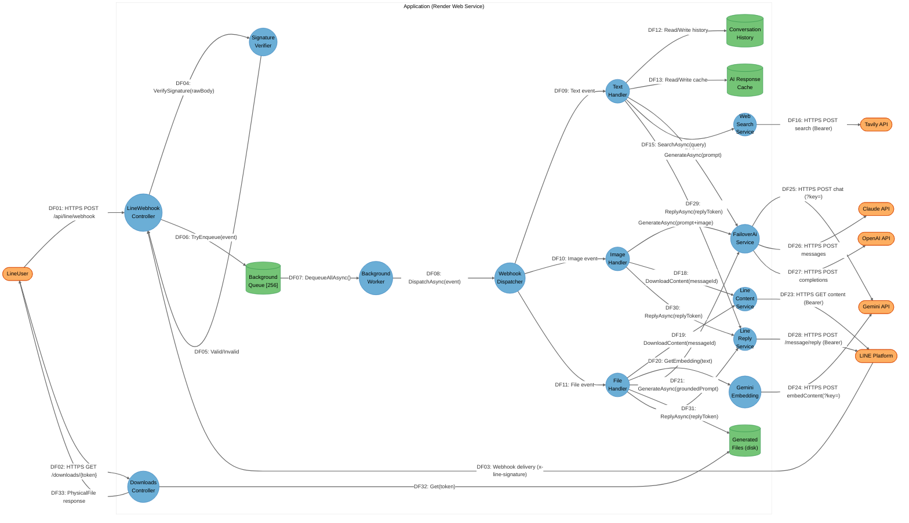

# Threat Model — Data Flow Diagram

**Project:** LINE Bot Webhook — `LineBotWebhook`
**Commit:** `811b2f5` (branch `main`)
**Analysis Date:** 2026-04-17

---

## DFD Diagram

---

## Element Table

### Processes

| ID | Name | Type | Boundary | Description |
|----|------|------|----------|-------------|
| P-01 | `LineWebhookController` | Process | Application | HTTP `POST /api/line/webhook` entry point; reads raw body, calls signature verifier, enqueues event |
| P-02 | `WebhookSignatureVerifier` | Process | Application | HMAC-SHA256 with `CryptographicOperations.FixedTimeEquals`; rejects on empty or invalid signature |
| P-03 | `WebhookBackgroundService` | Process | Application | `IHostedService` worker; per-event exception isolation; reads from bounded channel |
| P-04 | `LineWebhookDispatcher` | Process | Application | Routes events by message type; applies group mention gate |
| P-05 | `TextMessageHandler` | Process | Application | Full text pipeline: throttle → cache → date/time intent → web search → AI → reply |
| P-06 | `ImageMessageHandler` | Process | Application | Vision pipeline: download image from LINE → AI vision → reply |
| P-07 | `FileMessageHandler` | Process | Application | Document QA: download file → extract text → semantic grounding → AI → generate download |
| P-08 | `FailoverAiService` | Process | Application | AI orchestrator; tries Gemini → Claude → OpenAI; manages 429 backoff and in-flight merge |
| P-09 | `LineReplyService` | Process | Application | LINE Messaging API reply; `Authorization: Bearer {channelAccessToken}` |
| P-10 | `LineContentService` | Process | Application | Downloads message content (image/file) from LINE API with 10 MB size enforcement |
| P-11 | `WebSearchService` | Process | Application | Tavily web search; `Authorization: Bearer {tavilyKey}` |
| P-12 | `GeminiEmbeddingService` | Process | Application | Gemini embedding API; `?key={apiKey}` in URL |
| P-13 | `DownloadsController` | Process | Application | Serves generated files; no session auth — 128-bit Guid token only |

### Data Stores

| ID | Name | Type | Boundary | Description |
|----|------|------|----------|-------------|
| DS-01 | `WebhookBackgroundQueue` | Data Store | Application | Bounded in-memory channel (capacity 256); drops events on overflow |
| DS-02 | `ConversationHistoryService` | Data Store | Application | Per-user session history in-memory (max 1000 sessions, 15 rounds, 480 min TTL) |
| DS-03 | `AiResponseCacheService` | Data Store | Application | AI response cache in-memory (max 5000 entries, TTL-based) |
| DS-04 | `UserRequestThrottleService` | Data Store | Application | Per-user cooldown in-memory (max 2000 entries) |
| DS-05 | `GeneratedFileService` | Data Store | Application | Local ephemeral disk store; token-based access; 24 h TTL |

### External Interactors / Services

| ID | Name | Type | Boundary | Description |
|----|------|------|----------|-------------|
| E-01 | `LineUser` | External Interactor | External | LINE app end-user; ultimate message source and reply target |
| E-02 | `LINEPlatform` | External Service | External | LINE Messaging API; HMAC-signs webhooks; receives reply calls |
| E-03 | `GeminiAPI` | External Service | External | Google Gemini generative + embedding API |
| E-04 | `ClaudeAPI` | External Service | External | Anthropic Claude API |
| E-05 | `OpenAIAPI` | External Service | External | OpenAI API |
| E-06 | `TavilyAPI` | External Service | External | Tavily web search API |

---

## Data Flow Table

| ID | From | To | Data | Transport | Auth |
|----|------|-----|------|-----------|------|
| DF01 | LineUser | LineWebhookController | (via LINE Platform) | HTTPS | x-line-signature (HMAC-SHA256) |
| DF02 | LineUser | DownloadsController | File download request | HTTPS | Token in URL path |
| DF03 | LINEPlatform | LineWebhookController | Webhook event JSON, x-line-signature | HTTPS POST | HMAC-SHA256 |
| DF04 | LineWebhookController | WebhookSignatureVerifier | rawBody + signature | In-process | N/A |
| DF05 | WebhookSignatureVerifier | LineWebhookController | bool (valid/invalid) | In-process | N/A |
| DF06 | LineWebhookController | WebhookBackgroundQueue | WebhookQueueItem | In-process | N/A |
| DF07 | WebhookBackgroundQueue | WebhookBackgroundService | WebhookQueueItem | In-process | N/A |
| DF08 | WebhookBackgroundService | LineWebhookDispatcher | LINE event | In-process | N/A |
| DF09–11 | LineWebhookDispatcher | Message Handlers | Typed event | In-process | N/A |
| DF12 | TextMessageHandler | ConversationHistoryService | userId, messages | In-process | N/A |
| DF13 | TextMessageHandler | AiResponseCacheService | cacheKey, response | In-process | N/A |
| DF14 | TextMessageHandler | FailoverAiService | prompt + history | In-process | N/A |
| DF15 | TextMessageHandler | WebSearchService | search query | In-process | N/A |
| DF16 | WebSearchService | TavilyAPI | search query | HTTPS | Bearer token |
| DF17 | ImageMessageHandler | FailoverAiService | prompt + image bytes | In-process | N/A |
| DF18–19 | Image/FileHandler | LineContentService | messageId | In-process | N/A |
| DF20 | FileMessageHandler | GeminiEmbeddingService | text chunk | In-process | N/A |
| DF21 | FileMessageHandler | FailoverAiService | grounded prompt | In-process | N/A |
| DF22 | FileMessageHandler | GeneratedFileService | file bytes | In-process | N/A |
| DF23 | LineContentService | LINEPlatform | GET /message/{id}/content | HTTPS | Bearer token |
| DF24 | GeminiEmbeddingService | GeminiAPI | text for embedding | HTTPS | API key in URL `?key=` |
| DF25 | FailoverAiService | GeminiAPI | chat completions | HTTPS | API key in URL `?key=` |
| DF26 | FailoverAiService | ClaudeAPI | messages | HTTPS | API key (header) |
| DF27 | FailoverAiService | OpenAIAPI | completions | HTTPS | API key (header) |
| DF28 | LineReplyService | LINEPlatform | reply message | HTTPS | Bearer token |
| DF29–31 | Message Handlers | LineReplyService | replyToken, message | In-process | N/A |
| DF32 | DownloadsController | GeneratedFileService | token lookup | In-process | N/A |
| DF33 | DownloadsController | LineUser | file bytes | HTTPS | Token in URL path |

---

## Trust Boundary Table

| ID | Name | Description | Crossing Flows |
|----|------|-------------|----------------|
| TB-01 | Application | Single Render web service process | DF03, DF16, DF23–28, DF01, DF02 |
| TB-02 | External | LINE Platform + AI API providers + Tavily + end-user browser | All external HTTPS flows |
